  

  

  

 

| **Resultados de aprendizaje de la unidad didáctica:** |
|-|
| **RA. 1:** Planifica la creación de una interfaz web valorando y aplicando especificaciones de diseño.|  

 

|**Criterios de evaluación de la unidad didáctica:**|
|-|
| **CE. a&#41;** Se ha reconocido la importancia de la comunicación visual y sus principios básicos.|
| **CE. b&#41;** Se han analizado y seleccionado los colores y tipografías adecuados para su visualización en pantalla.|
| **CE. c&#41;** Se han analizado alternativas para la presentación de la información en documentos web.|
| **CE. d&#41;** Se ha valorado la importancia de definir y aplicar la guía de estilo en el desarrollo de una aplicación web.|  

 

| **Licencia Creative Commons:** | |
| - | - |
|  | **Reconocimiento-NoComercial-CompartirIgual CC BY-NC-SA:** No se permite un uso comercial de la obra original ni de las posibles obras derivadas, la distribución de la cuales se debe hace con una licencia igual a la que regula la obra original. | 
  
 

# 1. Introducción
Las aplicaciones y sitios web son esenciales en nuestra vida diaria para consultar información, gestionar trámites o comunicarnos. 
Independientemente del dispositivo, la web representa la imagen de una entidad, por eso es crucial que el contenido y las funcionalidades sean atractivos, accesibles y fáciles de usar (User Experience), con un diseño agradable que capte la atención del usuario (User Interface). 

# 2. Evolución del diseño web

  

 

**1991-1994 inicios de la web**  
- **1991:** Tim Berners-Lee crea la primera página web con solo texto y enlaces en HTML.  
- **1993:** Mosaic, primer navegador, permitiendo imágenes junto con texto.  
- **1994:** Netscape Navigator introduce mejoras en el renderizado de páginas y establece el estándar de navegación.  

 

**1995-1999: HTML y el diseño en tablas**  
- **1995:** Lanzamiento de JavaScript que aporta interactividad en el navegador.  
- **1996:** Aparece CSS (Cascading Style Sheets) para separar contenido y presentación. También surge Flash, revolucionando la animación en la web.  
- **1997:** HTML 4.0 se populariza con el uso de tablas para estructurar páginas web.  
- **1998:** Google aparece y cambia la forma de buscar información en la web.  
- **1999:** Se consolida el uso de Flash y JavaScript en la creación de interfaces interactivas.  

 

**2000-2006: CSS y el auge del diseño web**  
- **2000:** Se adopta CSS para diseños, reemplazando las tablas.  
- **2003:** Aparece WordPress, facilitando la creación de sitios web sin necesidad de programar.  
- **2004:** Se popularizan las técnicas de diseño líquido y adaptable.  
- **2005:** Nace AJAX, permitiendo recargar contenido sin necesidad de actualizar la página completa.  

 

**2007-2012: Móviles y responsive design**  
- **2007:** Apple lanza el iPhone.  
- **2010:** Ethan Marcotte introduce el término **Responsive Web Design (RWD)**, impulsando el diseño adaptable a cualquier dispositivo.  
- **2011:** HTML5 y CSS3 se consolidan, permitiendo animaciones sin Flash.  
- **2012:** Se expande el diseño minimalista con estilos planos y colores vibrantes.  

 

**2013-2019: UI/UX, frameworks y accesibilidad**  
- **2013:** Google presenta Material Design, estableciendo un estándar visual con sombras y animaciones realistas.  
- **2015:** Se popularizan frameworks como Bootstrap y Foundation para acelerar el desarrollo web.  
- **2016:** La velocidad y la accesibilidad se convierten en prioridades con la optimización para SEO y Core Web Vitals.  
- **2019:** Dark mode se convierte en una tendencia en muchas interfaces web.  

 

**2020-presente: IA, diseño sin código y Web 3.0**  
- **2020:** Herramientas como Webflow y Figma facilitan la creación de sitios sin necesidad de programar.  
- **2022:** La IA empieza a usarse para generar diseños y mejorar la experiencia del usuario.  
- **2024-2025:** Web 3.0, con blockchain y aplicaciones descentralizadas, empieza a redefinir la propiedad y seguridad en la web.  

 

# 3. Conceptos de IPO, UI y UX
## 3.1. - Interacción Persona-Ordenador (IPO)  
La **Interacción Persona-Ordenador (IPO)** es la ciencia que estudia la relación entre los seres humanos y los sistemas informáticos. Su objetivo principal es diseñar interfaces que permitan una comunicación eficiente, intuitiva y accesible entre los usuarios y las computadoras.  

Dentro de la IPO encontramos:  
- **Ergonomía y usabilidad**: Se busca que los sistemas sean fáciles de usar y reduzcan la carga cognitiva del usuario.  
- **Modelos de interacción**: Analiza cómo las personas perciben, aprenden y usan la tecnología.  
- **Diseño centrado en el usuario**: Enfatiza la importancia de diseñar software basado en las necesidades y comportamientos del usuario final.  
- **Accesibilidad**: Considera a usuarios con diferentes capacidades físicas o cognitivas para garantizar una experiencia inclusiva.
 

## 3.2. - Interfaz de Usuario (UI - User Interface)  

  

 

La **Interfaz de Usuario** es el medio a través del cual los usuarios interactúan con un sistema o aplicación. Puede incluir elementos visuales, táctiles y auditivos. Existen distintos tipos de interfaces:  

- **Interfaz gráfica (GUI - Graphical User Interface)**: Es la más común y se compone de menús, iconos y ventanas.  
- **Interfaz de línea de comandos (CLI - Command Line Interface)**: Utilizada principalmente por usuarios avanzados, no está diseñada para el gran público.  
- **Interfaces de voz (VUI - Voice User Interface)**: Usadas en asistentes virtuales como Alexa o Google Assistant.  
- **Interfaces hápticas**: Basadas en el tacto, como los dispositivos con retroalimentación por vibración.  

 

## 3.3. - Experiencia de Usuario (UX - User Experience) 

  

 

La **Experiencia de Usuario (UX)** abarca todos los aspectos de la interacción de una persona con un producto o servicio digital. Va más allá de la interfaz y se enfoca en la percepción global del usuario sobre la usabilidad, accesibilidad y satisfacción con el sistema.  

Los principales factores que influyen en la UX son:  
- **Usabilidad**: Facilidad con la que el usuario puede aprender y utilizar el sistema.  
- **Diseño visual**: La estética y la disposición de los elementos en la interfaz.  
- **Accesibilidad**: Adaptabilidad para usuarios con diversas capacidades.  
- **Flujo de interacción**: La estructura lógica de la navegación dentro de la aplicación o sitio web.  
- **Emoción y confianza**: La percepción del usuario sobre la seguridad y eficiencia del sistema.  

# 4. Componentes de una interfaz web
La **interfaz web** o **interfaz de usuario** es el punto de interacción entre el usuario y un sitio web o una aplicación. Para que sea efectiva, debe ser intuitiva, accesible y atractiva. 

Muchos de los componentes de una interfaz web, como la cabecera, los menús de navegación, el cuerpo, la barra lateral y el pie de página, se replican en la mayoría de los sitios web.  

  

 

Si convertimos esta estructura a código HTML, obtendremos el siguiente resultado.

  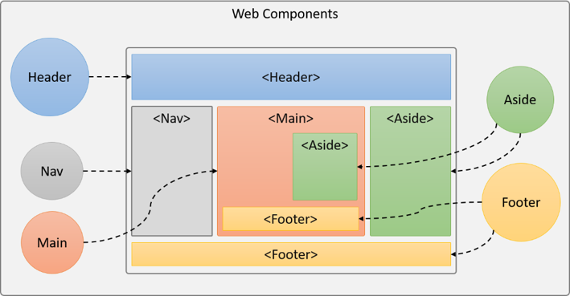

 

A continuación, veremos los componentes clave que toda interfaz web debe incorporar.  

## 4.1. - Elementos de identificación  
Los elementos de identificación son aquellos que permiten a los usuarios reconocer y recordar un sitio web específico. Su función principal es establecer la identidad visual y de marca, facilitando la navegación y la confianza del usuario.

- **Logotipo:** Un buen diseño es crucial para el recuerdo y la identidad visual.  
- **Nombre de dominio:** Debe ser claro y fácil de recordar.  
- **Título de la página:** Aparece en la pestaña del navegador y en **los resultados de búsqueda**. Debe ser conciso y descriptivo del contenido de la página.  
- **Imagen de cabecera:** Generalemente, aparece en la parte superior de la página y ayuda a entender el contenido de la web.  
- **Elementos de marca:** Incluyen colores, tipografía y otros elementos visuales que refuerzan la identidad corporativa de una marca.  
- **Favicon:** Icono que aparece en la pestaña del navegador junto al título de la página.  

## 4.2. - Elementos de navegación y acceso a contenidos  
Son los elementos encargados de organizar la información y permiten acceder de forma rápida e intuitiva a los diversos contenidos del sitio:  

- **Cabecera (Header):** Zona de la interfaz web situada en la parte superior y que sirve para identificar la empresa o marca. 
- **Barra de navegación (Navbar):** Menú que facilita el acceso a las diferentes secciones del sitio.
- **Menús y submenús**: Dentro de la barra de navegación, podemos encontrar listas de opciones, organizadas jerárquicamente para mejorar la experiencia de navegación.  
- **Barra lateral (sidebar):** La barra lateral es una área ubicada a la izquierda o derecha del contenido principal y contiene información adicional, enlaces a otras páginas o secciones...
- **Cuerpo de la página:** Parte en la cual se muestran los contenidos.  
- **Pie de página (Footer)**: Contiene enlaces, términos de uso y redes sociales.  

## 4.3. - Elementos de ordenación de contenidos  
Son los componentes que presentan la información al usuario:  

- **Encabezados y texto**: Estructuran la jerarquía del contenido.  
- **Imágenes e íconos**: Refuerzan el mensaje visual y mejoran la estética del sitio.  
- **Videos y multimedia**: Se utilizan para presentar información de manera más dinámica.  
- **Tablas y listas**: Organizan la información en formatos estructurados.  

## 4.4. - Elementos Interactivos  
Facilitan la interacción del usuario con la web, entre ellos tenemos:  

- **Botones**: Permiten realizar acciones como enviar formularios o navegar entre páginas.  
- **Formularios y campos de entrada**: Recolectan la información del usuario y realizan consultas a bases de datos.  
- **Sliders y carruseles**: Muestran contenido de forma dinámica en un espacio reducido.  
- **Pestañas y acordeones**: Organizan contenido en secciones colapsables para mejorar la usabilidad.  
- **Modales y pop-ups**: Ventanas emergentes que muestran información adicional o alertas.  

## 4.5. - Elementos de Retroalimentación  
En todo momento, informan al usuario del estado de sus acciones o consultas:  

- **Mensajes de éxito o error**: Notificaciones sobre el resultado de una acción, como el envío de un formulario.  
- **Tooltips y ayudas**: Pequeños textos emergentes que explican el uso de un elemento.  
- **Indicadores de carga (Spinners, progress bars)**: Informan sobre el estado de procesos en ejecución.  

## 4.6. - Tarea RA1-CEa
Elige una página web comercial e identifica sus diferentes componentes.
  

# 5. Diseño de una interfaz web
Generalmente esta área de desarrollo la llevan a cabo diseñadores gráficos. Entre sus tareas, destacan:
 1. Función estética.
 2. Función publicitaria.
 3. Función comunicativa.

Dentro de los elementos del diseño de interfaces se distinguen cuatro grupos: 

## 5.1. - Elementos conceptuales
**Los elementos conceptuales** son aquellos que son presentes en el diseño, pero que no son visibles a la vista. El punto, la línea, el plano y el volumen son la base del diseño y sobre ellos se asientan los otros elementos.

  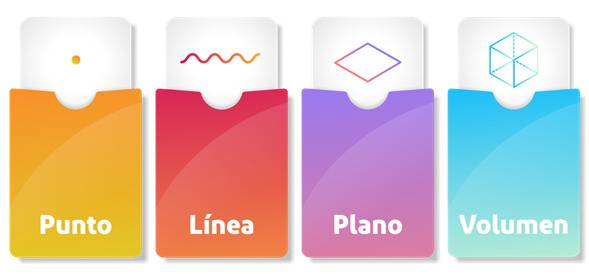

 

**Ejercicio**  
Identificar los elementos conceptuales de la siguiente página web.

  

## 5.2. - Elementos visuales
En el diseño web, los elementos visuales fundamentales incluyen **forma, color, medida y textura**.  

  

### 5.2.1. - Forma  
Define la estructura visual de los elementos dentro de una página web. Puede ser:  
- **Geométrica**: Cuadrados, círculos, triángulos, usados en botones, iconos o tarjetas.

  

    
  

 

- **Orgánica**: Formas irregulares o naturales, aportan dinamismo y originalidad.  

  

     
  

 

- **Abstracta**: Se utilizan para generar impacto visual sin representar objetos reales.  

  

     <a href="https://lovefreelancing.com/">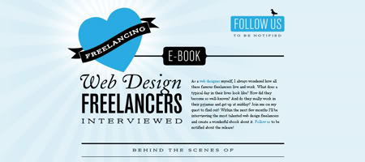</a>
  

 

### 5.2.2. - Color  
Influye en la percepción y la emoción del usuario. Se utiliza para:  
- **Generar identidad visual** (branding).  
  
  

     
  

 

- **Crear contrastes** y mejorar la accesibilidad.  

  

     
  

 
  

- **Diferenciar secciones** o establecer jerarquías.  

  

     
  

 

### 5.2.3. - Medida  
Hace referencia al tamaño y la escala de los elementos en una interfaz:  
- **Tipografía**: Tamaños de fuente adaptables para distintos dispositivos o contenidos.

  

     
  

 

- **Imágenes y gráficos**: Se escalan correctamente para mantener calidad y rendimiento.

  

     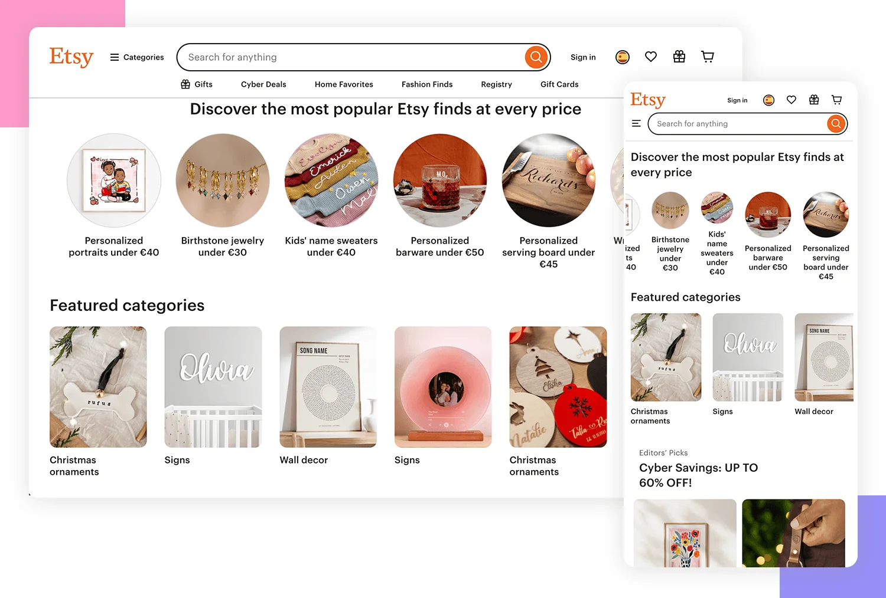
  

 

- **Espaciado y proporción**: Márgenes, padding y grids permiten un diseño equilibrado.

  

     
  

 

### 5.2.4. - Textura  
Aunque el diseño web es bidimensional, se pueden simular texturas para dar profundidad y sensación táctil:  
- **Fondos con degradados o patrones** para misterio y sofisticación.  

  

    
  

 

- **Sombras y efectos de iluminación** para realismo.  

  

    
  

   
 
 

- **Superposiciones y transparencias** para dinamismo.  

  

    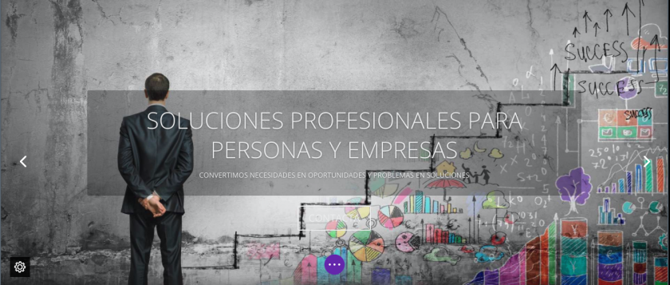
  

 

### 5.2.5. - Tarea RA1-CEc  
Identificar los errores visuales de las siguientes interfaces web. Comentar el tipo de error encontrado.   

**Interfaz** :one: 

 

**Interfaz** :two:

 

**Interfaz** :three:

 

**Interfaz** :four:

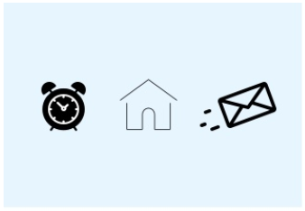

 

**Interfaz** :five:

 

**Interfaz** :six:

 

**Interfaz** :seven:

 

**Interfaz** :eight:
 

 

## 5.3. - Elementos de relación
Este grupo de elementos está relacionado con la ubicación y la interrelación de las formas dentro de una composición. La dirección y la posición pueden ser percibidas mientras que el espacio y la gravedad son sentidas.

  <!--  -->

 
 

- **Dirección:** Guía la mirada del usuario y se usa para organizar la información y definir el flujo de navegación. Existen tres tipos principales: **Horizontal**, **vertical** y en **diagonal o Z**.   

    
 

- **Posición:** La posición define dónde se colocan los elementos en la pantalla en relación con otros. Esto afecta la usabilidad y la coherencia visual.  

    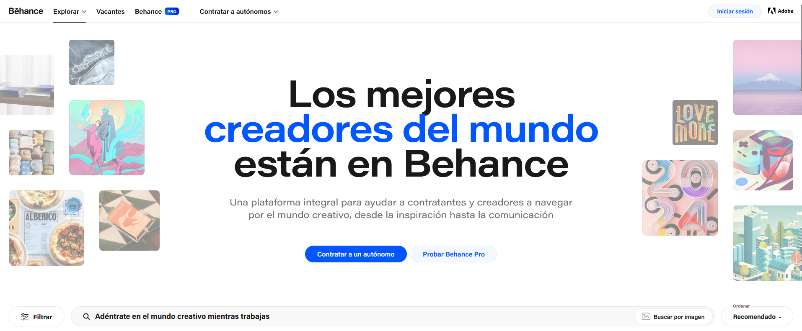
 

- **Espacio:** El espacio (white space) es fundamental para la legibilidad y la organización del contenido.  
  
    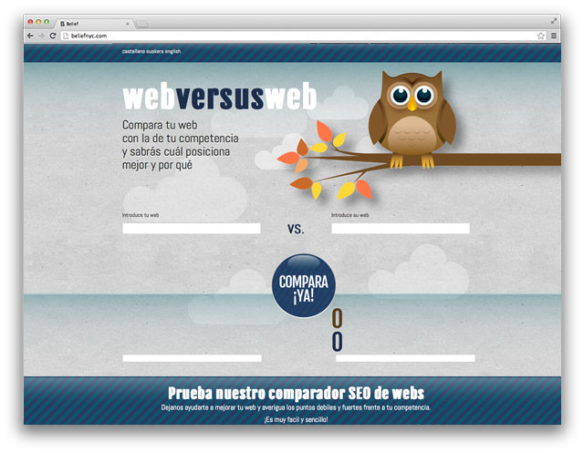
 

- **Gravedad:** La gravedad visual se refiere a la percepción del peso de los elementos en un diseño. Algunos factores que influyen en ella son: **Tamaño y color**, **sombra y profundidad** y **equilibrio visual**. 

    
 

## 5.4. - Elementos prácticos
En el diseño web, los **elementos prácticos** son aquellos que van más allá de la estética y se centran en la comunicación y la experiencia del usuario. Estos incluyen, entre otros, la representación, el significado y la función

  <!--  -->

 
 

- **Representación:** Se refiere a cómo se presentan los elementos visuales en la interfaz y su relación con la realidad o la abstracción.

    
 

- **Significado:** Es el mensaje o la idea que transmite un elemento dentro del diseño. Puede ser, **explícito** o **implícito**. 

    
 

- **Función:** Es el propósito práctico de cada elemento en la interfaz y cómo contribuye a la experiencia del usuario. La función puede ser **informativa**, **interactiva** o **estructural**.

    
 

## 5.5. - Patrones de diseño, psicología de la Gestalt

### 5.5.1. - Introducción
La psicología de la Gestalt es una corriente de la psicología moderna, surgida en Alemania a principios del siglo XX, cuyos exponentes más reconocidos fueron Max Wertheimer, Wolfgang Köhler, Kurt Koffka​ y Kurt Lewin.

Su premisa principal es que "el todo es más que la suma de sus partes", es decir, la mente organiza la información **en patrones y estructuras significativas en lugar de procesar elementos aislados**.

### 5.5.2. - Principios de la Gestalt
La Gestalt propone una serie de principios que explican cómo organizamos la información visual y cognitiva. En **el diseño de la UX/UI**, los principios de la Gestalt se aplican para mejorar la experiencia del usuario.

- **Principio de la experiencia:**  
    Este principio se basa en el hecho que la percepción del ser humano está fundamentado de acuerdo **sus propias experiencias**. Así pues, buscaremos que los diseños compartan similitudes con las experiencias de los usuarios.

     
      

    **Iconos de FontAwesome** cuyas funciones identificamos inmediatamente.  

    
      

- **Principio de simetría:**   
    Las imágenes simétricas son percibidas como iguales, como un solo elemento, en la distancia. 

    
      
    
    **Contenidos** organizados de forma simetrica.  
    
    
      

- **Principio de proximidad**  
    Los objetos adjuntos tienden a ser vistos como una unidad. Los estímulos que están próximos tienden a percibirse como parte de la misma unidad.  

    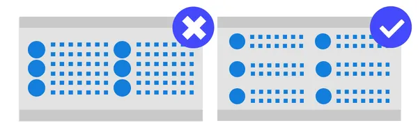
      
    
    **Organización de contenidos** siguiendo el principio de proximidad. 
    
    
      

- **Principio de similitud**  
    La mente agrupa los elementos similares en una entidad. La semejanza depende de la forma, del tamaño, del color y de otros aspectos visuales de los elementos.  

    
      
    
    **Similitud** entre 2 secciones de precios.  
    
    
      

- **Principio de continuidad**  
    Los detalles que mantienen un patrón o dirección tienden a agruparse juntos, como parte de un modelo. Es decir, percibimos elementos continuos, aunque estén interrumpidos entre sí.  

    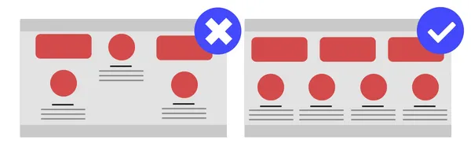
      
    
    **Percepción de continuidad** del carrusel a pesar de la interrupción abrupta de los contenidos.
    
    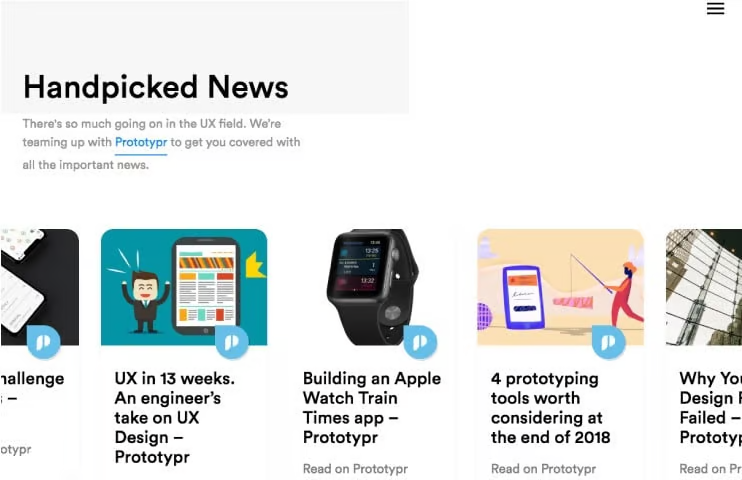
      

- **Principio de simplicidad**  
    El individuo organiza sus campos perceptuales con rasgos simples y regulares.  
   
    
      
    
    **Página simplificada** al máximo para evitar de crear malestar entre los posibles clientes.
    
    
      

- **Principio de dirección común**  
    Implica que los elementos que parecen construir un patrón o un flujo en la misma dirección se perciben como una figura.  
   
    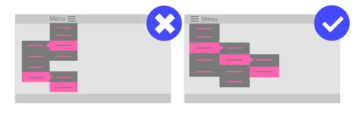
      
    
    **Las flechas del carrusel** no indican la posibilidad de movimiento horizontal del elemento.  
    
    
      

- **Principio de figura y fondo**  
    Este principio describe la tendencia del ojo humano a ver y separar los elementos de su entorno. No podemos percibir una misma forma como figura y fondo a la vez. El fondo es todo el que no se percibe como figura.  

    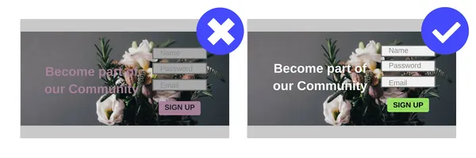
      

    **El contraste entre figura y fondo** nos hace separar el elemento principal del resto de la imagen.
    
    
      

- **Principio del cierre**  
    Es una tendencia del ojo humano a completar una infomración parcial.
   
    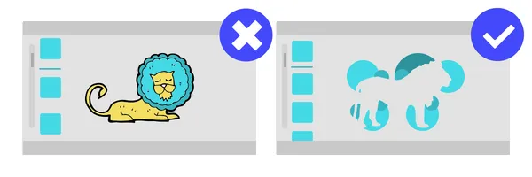
      
    
    **El contraste de las flechas** nos hace entender que falta información en la página web. 
    
     
      

## 5.6. - Colores y teoría del color 
El color es el **medio esencial** para tocar las emociones de los visitantes del sitio web porque crea una reacción física y emocional. Los colores son capaces de establecer el tono adecuado (calmar, excitar, estimular a las acciones). 
Cuando se establece un **esquema de color** para el diseño web es importante hacerlo correctamente, guiándose por los principios de la teoría del color.

El color es un **elemento fundamental** en el diseño web, ya que influye en las emociones y reacciones de los visitantes. Puede ayudar a establecer el tono adecuado del sitio (calma, excitación, estímulo a la acción) y generar una conexión emocional con los usuarios. 
Sin embargo, su impacto es más efectivo cuando se combina con otros aspectos del diseño, como la tipografía, la disposición de los elementos y las imágenes. 
Al definir un esquema de color, es importante hacerlo de manera estratégica, basándose en los principios de la **teoría del color** para lograr una experiencia visual coherente y atractiva. 

### 5.6.1. - Círculo cromático
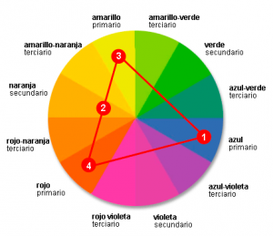

El círculo cromático es una herramienta indispensable para diseñadores. Consiste en 6 colores básicos (rojo, naranja, amarillo, verde, azul y violeta).  
Para elegir una gama o mezcla armoniosa, hay que elegir dos colores opuestos entre sí (por ejemplo 1 y 2), y otros 2 igualmente espaciados entre sí (p.e. 3 y 4).
Al final obtendremos el triángulo de colores de la figura también llamado **esquema de colores**.

Para este ejemplo distinguiremos:
- Colores primarios: **Rojo**, **amarillo** y **azul**.  
- Colores secundarios: **Naranja**, **verde** y **violeta**.
- Colores terciarios: Se obtienen mezclando un color primario con otro secundario.
- Colores complementarios: Son los colores opuestos en el círculo cromático (rojo - verde, azul - naranja, violeta - amarillo).

Cada combinación (esquema) de colores transmite una sensación diferente.

### 5.6.2. - Esquemas de color  
Se pueden aplicar diferentes combinaciones de colores dependiendo de su finalidad. 

1️⃣ **Monocromático**: Usa diferentes tonos de un solo color. Proporciona un diseño limpio y armonioso.  
2️⃣ **Complementario**: Usa colores opuestos en el círculo cromático (ej. azul y naranja). Crea alto contraste y dinamismo.  
3️⃣ **Análogo**: Usa colores adyacentes (ej. azul, azul verdoso y verde). Genera una apariencia equilibrada y natural.  
4️⃣ **Triádico**: Usa tres colores equidistantes (ej. rojo, amarillo y azul). Aporta diversidad y equilibrio.  
5️⃣ **Tetrádico**: Usa dos pares de colores complementarios. Es vibrante, pero requiere equilibrio para no saturar el diseño.  

### 5.6.3. - Enlaces de interés
Para facilitar la selección de colores en diseño web, existen herramientas como:  
✔ [Adobe Color](https://color.adobe.com/)  
✔ [Coolors](https://coolors.co/)  
✔ [Paletton](https://paletton.com/)  

### 5.6.4. - Ejemplos del uso de esquemas de colores en páginas web  
 

:one: El blanco y el negro transmiten elegancia, simplicidad y eficiencia. Es el mismo que busca Apple en todos sus productos.  

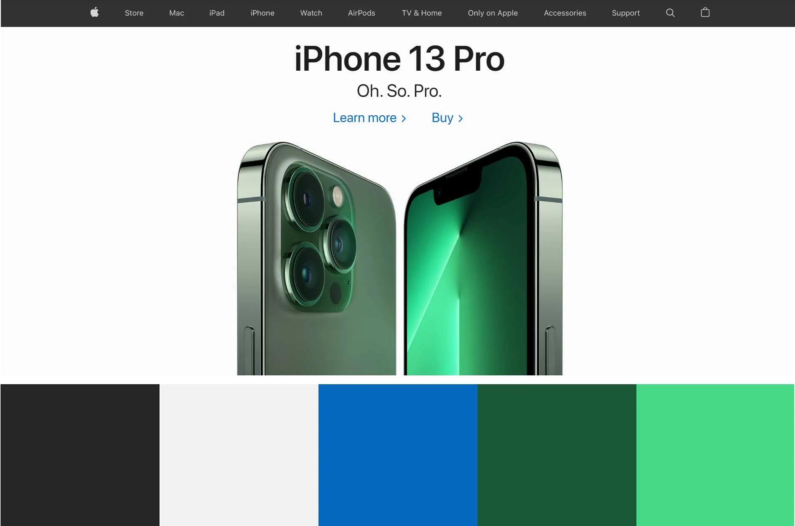 
   
 

:two: Un fondo negro combinado con colores grises y cafés apagados generan un ambiente lúgubre.  

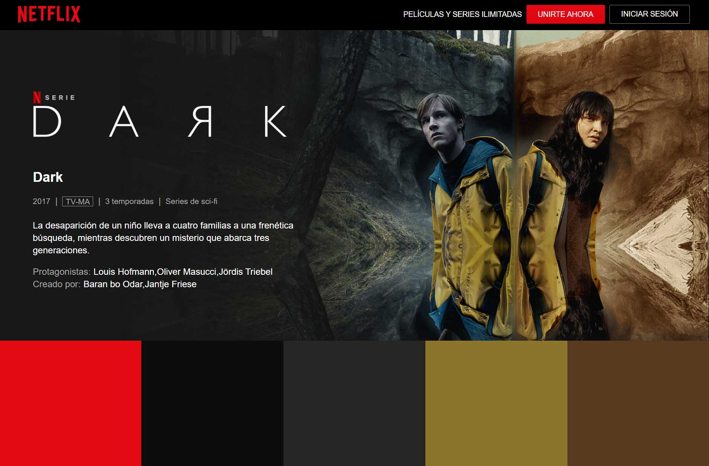
 
 

:three: Sección Amarilla elige el negro y el amarillo para captar la atención.  

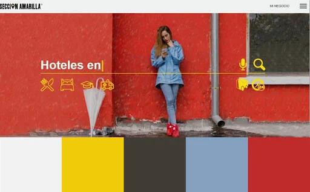   
 
 

:four: Los colores claros hacen destacar el color rojo.  

    
 
 

:five: Fingerspelling enseña el lenguaje de signos. En su paleta de colores solo se encuentran el morado y el amarillo que son complementarios entre sí.  

 
 

:six: La combinación del azul y verde transmite calma y seguridad.  

 
 
 

:seven: En la página de Schweppes, predomina el amarillo para expresar su personalidad alegre y desenfadada.  

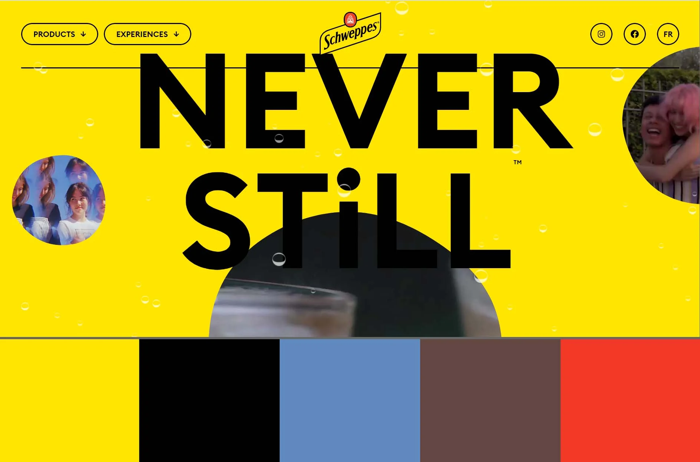
 
 

:eight: Los gradientes permiten combinar diferentes tonos de un mismo color de manera suave y gradual, creando añadiendo profundidad a los elementos del sitio web.  

  
 
 

:nine: Las transparencias añaden profundidad y permiten una integración más armoniosa de los elementos en la página.  

 
 
 

:one::zero: Las ilustraciones en 2D transmiten un aspecto sofisticado y moderno a los diseños.  

 
 

:one::one: Los colores suaves y naturales como el beige, marrones y verdes apagados crean una sensación de calma y tranquilidad.  

 
 
 

:one::two: Los colores brillantes y llamativos se utilizan para atraer la atención del usuario y resaltar elementos importantes.  

 
 

# 6. Guías de estilo 
Las **guías de estilo** son documentos que establecen las reglas visuales y funcionales para garantizar la coherencia en una página web. Estas guías ayudan a mantener una identidad de marca clara y una experiencia de usuario uniforme en todos los dispositivos y plataformas.

## 6.1. - Elementos clave de una guía de estilo
:one: **Logotipos y colores corporativos**  
   - Logotipos de empresa. 
   - Paleta de colores.   
   - Tamaños y diseños recomendados.  
 

:two: **Componentes UI**  
   - Botones, formularios, iconos y otros elementos interactivos.  
   - Consistencia en tamaños, bordes y sombreados.
 

:three: **Paleta de colores**  
   - Colores primarios y secundarios.  
   - Variaciones y usos específicos (botones, fondos, enlaces, etc.).  
   - Contraste y accesibilidad.
 

:four: **Tipografía**  
   - Fuentes principales y secundarias.  
   - Tamaños y pesos para títulos, subtítulos y cuerpo de texto.  
   - Espaciado entre líneas y párrafos.
 

:five: **Imágenes e Ilustraciones**  
   - Logotipos de empresa.
   - Estilo de imágenes (fotografía, ilustración, gráficos SVG).  
     

:six: **Espaciado y Layout**  
   - Márgenes y paddings para mantener una estructura uniforme.  
   - Breakpoints y diseño responsivo.
 

:seven: **Estilo de Interacciones**  
   - Efectos de hover y transiciones.  
   - Animaciones y microinteracciones.  
   - animaciones visuales en formularios y botones.
 

:eight: **Accesibilidad**  
   - Buen contraste de colores.  
   - Uso correcto de etiquetas semánticas en HTML.  
   - Soporte para lectores de pantalla.

:arrow_right: Lista no exhaustiva.

## 6.2. - Tarea RA1-CEd
Elegir una página web al azar y extraer la guía de estilos. 

## 6.3. - Ejemplos de guías de estilos 
:one: **airbnb**

 
 

:two: **Bacardi**  

 
 
 

:three: **Cruz roja Americana**    

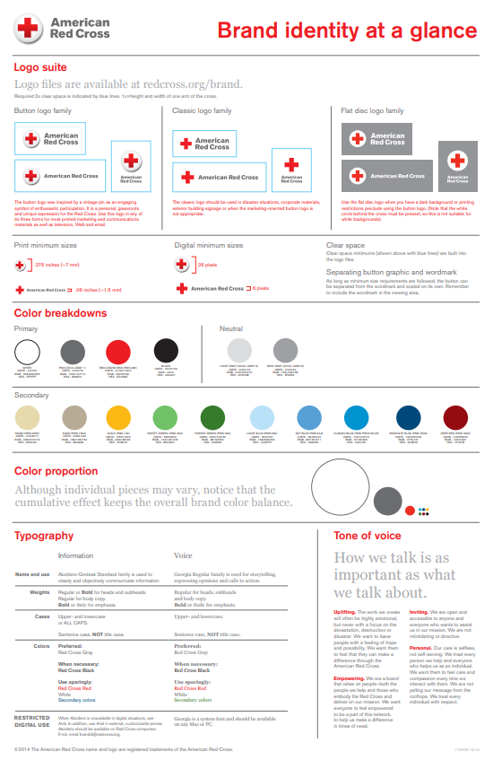
 

## 6.4. - Documentación de guías de estilos 
Algunas marcas y plataformas han publicado sus guías de estilo para que los desarrolladores y diseñadores puedan seguir sus estándares:

- <a href="https://material.io/">**Material Design** (Google)</a>
- <a href="https://developer.apple.com/design/">**Human Interface Guidelines** (Apple)</a>
- <a href="https://carbondesignsystem.com/">**Carbon Design System** (IBM)</a>
- <a href="https://design.samsung.com/global/contents/one-ui/download/oneui_design_guide_eng.pdf">**Samsung Design** (Samsung)</a>. <a href="https://design.samsung.com/global/contents/one-ui/download/oneui_design_guide_eng.pdf">Guía de estilo en formato pdf</a>

# 7. Responsive design 
## 7.1. - ¿Qué es el Responsive Design?
Un sitio web que no se muestra correctamente en una variedad de dispositivos genera una experiencia negativa para los usuarios. A partir de esta necesidad surge el Responsive Design.

El **Responsive Design, o diseño adaptativo**, es la técnica utilizada actualmente para lograr que una página web se adapte a cualquier dispositivo tecnológico, como ordenadores, tabletas, teléfonos inteligentes y relojes inteligentes.

## 7.2. - Breakpoints
Un **breakpoint** en diseño web responsivo es el **punto en el que el contenido y el diseño** de un sitio web **se ajustan** de manera específica para brindar la **mejor experiencia de usuario posible**. En otras palabras, los puntos de corte determinan cómo se visualiza un sitio web en función del tamaño de la pantalla.  

Agregar **breakpoints** mejora la legibilidad en cualquier dispositivo, ya que existen puntos de corte específicos para distintos tamaños de pantalla. Sin embargo, estos pueden personalizarse para garantizar una mayor flexibilidad y adaptabilidad a diferentes dispositivos.

## 7.3. - Métodologia para obtener un diseño web responsive
- **HTML y CSS.** Estas dos tecnologías permiten redimensionar, ocultar, reducir o ampliar automáticamente los elementos de un sitio web para mejorar su adaptabilidad.  
- **Consultas de medios (*media queries*).** Técnica de CSS que ajusta el diseño de sitios web y aplicaciones según el tipo de dispositivo o características específicas, como el tamaño y la resolución de la pantalla.  
- **Diseño (*layout*).** Un diseño fluido utiliza valores en porcentaje para adaptarse al tamaño de la pantalla, mientras que técnicas como *flexbox* y *grid* permiten distribuir los elementos de manera más eficiente.  
- **Imágenes responsivas.** Permiten ajustar automáticamente el ancho y la altura de las imágenes para adaptarlas a cualquier tamaño de pantalla, mejorando la experiencia de usuario y la carga del sitio.  
- **Velocidad.** Un sitio web más rápido mejora la experiencia del usuario y el posicionamiento en buscadores (*SEO*). Optimizar imágenes, reducir solicitudes innecesarias y mejorar la caché contribuye a una carga más eficiente.

## 7.4. - Buenas prácticas de diseño web responsive
- **Priorizar el contenido**  
Asegurarse de que los usuarios puedan encontrar la información con el mínimo desplazamiento o navegación. Mientras que en un escritorio se requiere menos desplazamiento para visualizar el contenido, en un dispositivo móvil la misma información puede generar una mala experiencia de usuario si el contenido es demasiado extenso o si la tipografía y las imágenes no se adaptan correctamente a la pantalla.  

- **Reducir la fricción**  
Es fundamental adaptar cada versión del sitio web según el dispositivo. Adoptar un enfoque *mobile-first* ayuda a los diseñadores a definir qué elementos son realmente necesarios para alcanzar los objetivos principales de la pa´gina web (compra de un producto o servicio).  

- **Pensar con los dedos**  
Asegúrate de que las partes más importantes de la página sean fácilmente accesibles para quienes navegan desde un dispositivo móvil. Este factor cambia la forma en que los diseñadores crean áreas táctiles y otros elementos interactivos. 

- **Diseño y desarrollo en conjunto**  
El diseño web responsivo implica que tanto el diseño como el desarrollo deben adaptarse al comportamiento y entorno del usuario, por lo que es fundamental que trabajen de manera conjunta. Diseñadores y desarrolladores deben colaborar para definir cómo se reorganizará el contenido y cuál será el resultado final.  

- **Probar, probar y probar de nuevo**  
Es fundamental realizar pruebas de usabilidad en diferentes plataformas de forma regular. Se debe evaluar la navegación del sitio, ya que esta debe adaptarse al dispositivo utilizado. Es esencial verificar que los diseños de navegación funcionen correctamente en distintas pantallas y no generen una mala experiencia de usuario.  

También se deben probar las tipografías en varios dispositivos. Aunque se utilicen diferentes fuentes y métodos de diseño para presentar el contenido, algunas tipografías pueden no ser compatibles con todos los sistemas, lo que podría provocar que se transformen en caracteres aleatorios o códigos ilegibles. Por ello, es importante probarlas antes de implementar cambios en el sitio web.  

Asimismo, es recomendable probar combinaciones de dispositivos y navegadores. Analizar el tráfico web y móvil con herramientas como Google Analytics permite identificar los navegadores más utilizados para acceder al sitio y optimizar la compatibilidad.  

Por último, es crucial evaluar la velocidad del sitio web, considerando el tiempo de carga de imágenes, videos y otros elementos en distintos dispositivos.

